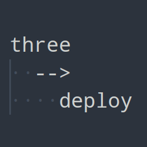

# Python-Thingideploy <!-- omit in toc -->

Python app to automatically deploy a project to Thingiverse.

If you like my work please consider supporting my caffeine addiction!

## Table of contents <!-- omit in toc -->

- [The concept](#the-concept)

## The concept

Testo