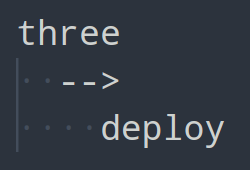

Python app to automatically deploy a project to Thingiverse. Can be used manually, but is really supposed to be used via GitLab CI/CD or Github Actions for example.

Providing the correct project structure, Thingideploy will do the following:
- Read Thing metadata from `thingdata.json`
- Create a Thing based on your provided data, or patch an existing one
- Update the name, tags, ~~description~~ (currently broken on Thingi side apparently), license, category and WIP state of your thing
- Publish your thing, if flag is set
- Upload found 3D files / known project source files, or replace existing ones if local files have been modified since upload
- Upload found images or replace existing ones

Additionaly, there is a [project creation mode](#project-creation-mode) to create the [expected folder structure](#expected-folder-structure) and generate initial Thing metadata, as well as an [API token request mode](#api-token-request-mode) to generate your own API token.

Please see my [example Repo](https://gitlab.com/chrismettal/LasS0) where Thingideploy is used for automatic CI/CD deployment!


---

:construction: :construction: :construction:

## WIP WARNING <!-- omit in toc -->

This project is early work in progress. While Thing creation and deploying works, automatic API token generation is not implemented yet. Logging and error handling is more of a suggestion right now. This is basically only released so I can use it already in other pipelines. Usage instructions are updated here as the project evolves.

:construction: :construction: :construction:

---

# Table of contents <!-- omit in toc -->

- [Usage](#usage)
  - [Requirements](#requirements)
  - [Project creation mode](#project-creation-mode)
  - [API token request mode](#api-token-request-mode)
  - [Deployment mode](#deployment-mode)
  - [Pipeline usage](#pipeline-usage)
- [Expected folder structure](#expected-folder-structure)
- [thingdata.json](#thingdatajson)
- [Supported files](#supported-files)
  - [Model files:](#model-files)
  - [Source files:](#source-files)
  - [Image files:](#image-files)

If you like my work please consider supporting my caffeine addiction!

<a href='https://ko-fi.com/U7U6G0X3' target='_blank'></a>


# Usage


## Requirements

With Python 3 installed run:

`pip install -R requirements.txt`

To fetch all required modules. 


## Project creation mode 

```bash
./thingideploy.py --create-project --path </path/to/new/project_folder>
```

Will create the [expected project structure](#expected-folder-structure) along with all required files at the given location, inside the `project_folder`. 

*Warning*, `project_folder` itself needs to exist before calling, as the other modes could break if it doesn't already.

Every text file that already exists, will be backed up like `thingdata.json` --> `thingdata.json.backup_<Timestamp>` before the new file is generated fresh. These backup files are put in the `.gitignore` so make sure to not `git clean` them away when overwriting your files accidentaly.


## API token request mode

```bash
thingideploy.py --request-token
```

Will open up your default webbrowser, promting you to login to Thingiverse and grant access to Thingideploy. 

After you have granted access, you will be forwarded to the Thingiverse homepage, but the response URL in your browsers address bar will contain your newly created API token. Copy this whole link and paste it into the command line when promted. Thingideploy will sanity check the link provided, and show you your API key for safekeeping. 

The API key is NOT saved in the application in any form and is only shown shown now! Save the key in a safe location, and use it later in deployment mode with the argument `--deploy-project <YourApiToken`.


## Deployment mode

```bash
thingideploy.py --deploy-project <YourApiToken>  --path </path/to/new/project_folder>
```

Will deploy your project to Thingiverse. The first time this is called, a new Thing is created on Thingiverse, `thingdata.json` will be updated with the new `thing_id`, and all your files will be uploaded for the first time. If the Thing already exists (checked with `thingdata.json`.`thing_id`) it will try to patch your Thing. 

Please also check [Pipeline usage](#pipeline-usage) for information on how to automate deployment.

Deploying your thing will:

- Compare model / gcode and source files on Thingiverse with your local ones, deleting and reuploading the ones where your local timestamp is newer than the upload timestamp on Thingiverse
- Delete and reupload all pictures, as there is no image timestamp to compare to
- Set display order of your images base on the [filename](#image-files)
- ~~Replace Thing summary with your README.md contents~~ / *CURRENTLY BROKEN IN API*
- Replace all tags on Thingiverse with `thingdata.json`.`tags`
- If `thingdata.json`.`is_published` is set, but thing is not already public, publish the Thing
- Add `Work in progress` information, depending on `thingdata.json`.`is_wip`
- Set `License` and `Category` depending on `thingdata.json`

*Warning* Thingiverse is amazingly slow to react to new file uploads and metadata changes. After calling with `--deploy-project`, allow Thingiverse to catch up for around 15 minutes before checking your Thing.


## Pipeline usage

:construction: :construction: :construction:

WIP, please see my [example Repo](https://gitlab.com/chrismettal/LasS0) where Thingideploy is used for automatic CI/CD deployment!

:construction: :construction: :construction:


# Expected folder structure

The program expects files in the following structure:

- `/project_folder/`     - Path that is input as command line argument like `./thingideploy.py /home/user/project_folder`
  - `gcode/`            - Location for sliced gcode files
    - `README.md`       - Describing your gcode location
  - `img/`              - Location for images
    - `README.md`       - Describing your image location, see also [image files](#image-files)
  - `source/`           - Location for project source file, FreeCAD, OpenSCAD project file etc.
    - `README.md`       - Describing your source file location
  - `3d/`               - Location for printable 3d files like stl, obj etc.
    - `README.md`       - Describing your 3d model file location
  - `thingdata.json`    - Storage for Thing metadata / settings
  - `README.md`         - Project description that is uploaded to Thingiverse as `Summary` once the API actually works again
  - `.gitignore`        - .gitignore containing ignored files created from this script

Additionally, the script will sometimes create the following files:

- `project_folder/`
  - `**/*.backup_<Timestamp>` - When a new textfile is being created which already exists, the old one will be backed up here
  - `CreationResponse.json`   - Dump of the API response during first project deployment
  - `PatchResponse.json`      - Dump of the API response during project patching
  - `InitialCreation`         - Will get touched after initial creation, only to notify CI/CD pipelines to update `thingdata.json` with the newly received `thing_id`


# thingdata.json

Example `thingdata.json`, providing Thing metadata:

```json
{
    "id": 1234567,
    "name": "BestThing",
    "creator": "Chrismettal",
    "is_wip": true,
    "license": "gpl",
    "category": "3D Printer Parts",
    "tags": [
        "3D",
        "Printing"
    ],
    "is_published": false
}
```

This file is required to exist before deployment, and is best generated with the `--create-project` option.

`creator` is just used as a plausibility check before trying to patch a Thing that you don't own, so it needs to contain your Thingiverse name.All other options have direct impact on all Thing settings that are exposed to the API. Thing summary is supposed to be set via the projects `project_path/README.md` but currently does not work.


# Supported files

Supported file extensions are practically arbitrary for Thingideploy and might later be read in from a seperate file rather than being hardcoded. Only there as a sanity check so you don't try uploading executables to Thingiverse.


## Model files:

- .stl
- .stp
- .STEP
- .obj
- .3mf
- .gcode


## Source files:

- .FCStd
- .scad
- .f3d


## Image files:

- .png
- .jpg
- .bmp

Image files are sorted (ranked) via the file name. Make sure to use the following naming format:

`RR-YourImageName.*`

Where `RR` is a 2 char integer for image ranking, for example `01-Cover.png` will put your that file as the first image in order. Make sure every image has a unique rank name, like:

- `01-Cover.png`
- `02-Side.png`
- ...
- `12-FinalPicture.png`